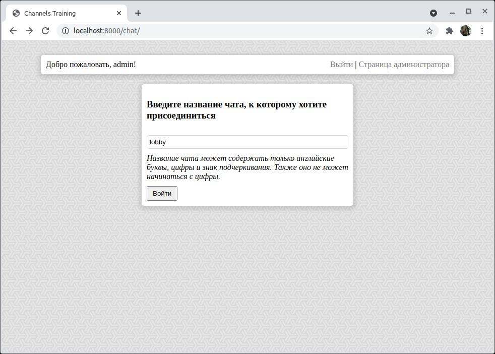

# ChannelsTraining
Учебный проект по Django Channels

Почти год назад я написал небольшой и крайне примитивный чат на Django - [PyChat](https://github.com/SergeyLebidko/PyChat). Код этого чата был плох буквально во всем - я не умел толком верстать, мои навыки работы с CSS и JavaScript были очень ограничены и приложение вышло откровенно неудачным. Достаточно сказать, что для получения сообщений клиенты чата регулярно (по установленному таймеру) слали на сервер запросы новых сообщений. Прямо скажем, очень плохо масштабируемое решение.

Я люблю возвращаться к старым задачам спустя некоторое время, чтобы решить их по-новой, но уже с применением новых навыков. И теперь решил вернуться и к задаче создания чата, но уже с применением протокола WebSocket.

Так как и фронт- и бекэнд для своих проектов я пишу сам, то мне предстояло разобраться и с основами работы веб-сокетов как на сервере, так и на клиенте.

Для изучения сокетов я решил взять за основу очень небольшое демонстрационное приложение, разработка которого показана [тут](https://channels.readthedocs.io/en/stable/tutorial/part_1.html) и [тут](https://channels.readthedocs.io/en/stable/tutorial/part_2.html).

Но я много добавил к функциональности и коду приложения и от себя:

- Регистрация и вход нового пользователя с использованием стандартных средств Django
- Допуск на страницы чата только аутентифицированных пользователей
- Вёрстка и оформление с помощью CSS
- Хранение списка активных чатов в Redis
- Возможность как создать новый чат, так и присоединиться к уже активному
- Хранение сообщений чата в Redis (только что присоединившийся пользователь видит все сообщения чата, добавленные до его входа в чат)

Сейчас в БД приложения создано три пользователя:

- admin (пароль admin). Также является суперпользователем
- thanos (пароль Rd123456789)
- ironman (пароль Rd123456789)

## Запуск приложения

Я проверял работоспособность приложения на linux с установленным redis и сервером uvicorn. Ниже я привожу последовательность необходимых для запуска действий:

- Выполнить клонирование проекта командой ```git clone```
- Создать в папке проекта виртуальную среду python командой ```virtualenv venv```
- Активирровать созданную на предыдущем шаге среду (командой ```source venv/bin/activate```)
- Установить зависимости проекта командой ```pip install -r requirements.txt```
- В файле settings.py проекта перевести проект в эксплутационный режим (```DEBUG=False```) и установить список разрешенных хостов (для простоты ```ALLOWED_HOSTS=['*']```)
- Выполнить команду ```manage.py collectstatic```
- Выполнить команду ```export DJANGO_SETTINGS_MODULE=ChannelsTraining.settings```
- Запустить сервер командой ```uvicorn --host 0.0.0.0 --port 8000 ChannelsTraining.asgi:application```

После этого можно войти в приложение (например, по адресу localhost:8000/chat/ - если сервер запущен на той же машине, на которой осуществляется вход)





